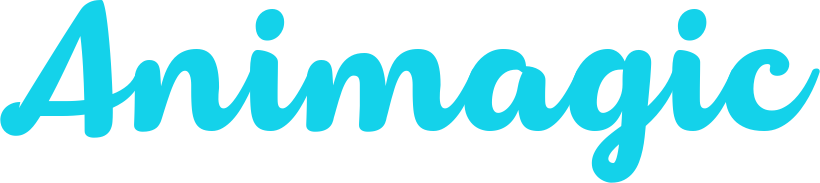

<h1 align="center">
    
</h1>

<p align="center">
  <a href="#-projeto">Projeto</a>&nbsp;&nbsp;&nbsp;|&nbsp;&nbsp;&nbsp;
  <a href="#-tecnologias">Tecnologias</a>&nbsp;&nbsp;&nbsp;|&nbsp;&nbsp;&nbsp;
  <a href="#-layout">Layout</a>&nbsp;&nbsp;&nbsp;|&nbsp;&nbsp;&nbsp;
  <a href="#-como-rodar-o-projeto">Como rodar o projeto</a>
</p>

<p align="center">
  
</p>

## 💻 Projeto

A Animagic é uma plataforma online baseada na Netflix que serve de catálogo para filmes clássicos de animação.

> Construído durante a Imersão React da [Alura](https://www.alura.com.br/)


## 🔧 Tecnologias

Esse projeto foi desenvolvido com as seguintes tecnologias:

- [Node.js](https://nodejs.org/en/)
- [React](https://reactjs.org/)
- [Styled-Components](https://styled-components.com/)

## 🔖 Layout

Você pode visualizar o layout do projeto através [desse link](https://www.figma.com/file/A1EPk0E6cZwNsMSkceAKgD/AluraFlix?node-id=0%3A1). Lembrando que você irá precisar ter uma conta no [Figma](http://figma.com/).

## 🤔 Como rodar o projeto

Após clonar, acesse ele via terminal e rode os comandos:

```sh
npm install
npm run dev
```